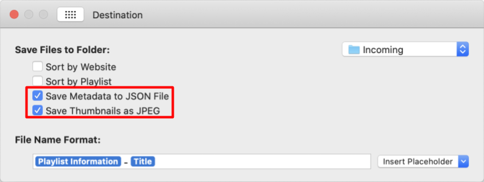

# DownieGalleryBuilder

### Description
A simple ruby script which processes results from the OS X app [*Downie 4*](https://software.charliemonroe.net/downie/) into an HTML file. 

### Installation
1. Downie 4 must be configured to produce JSON and thumbnails. These are used to build the HTML and are how the script determines what to include in the resulting gallery.

1. Download this repository.
1. `cd` into the directory for this repository.
1. Run the script:
`ruby build.rb`

### Flags
All flags are optional.

- `-i` *(Optional)* Input directory (Default: The directory where Downie 4 is configured to save files)
- `-o` *(Optional)* Output location (Directory or specific file; Default: `~/Desktop/gallery.html`)
- `-t` *(Optional)* Title of the resulting gallery (Default: Gallery)
